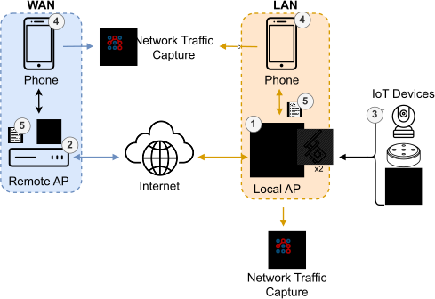

# Setup
This guide covers preparing the **server**, **Android**, and **iOS** devices used with CapIoT.  
For a deep dive into the testbed design, see Chapter 5 of the [thesis]().

## Overview



In the LAN case, the phone (4) connects to IoT devices (3) through the local access point (AP) (1), while in the WAN case, the phone (4) communicates via a remote AP (2) over the Internet. CapIoT (5) is running in both settings to capture network traffic.


## Server
> **OS requirement:** Linux 

## Packages
- `libimobiledevice-utils` (e.g., for `idevice_id`)
- `adb` (Android Platform Tools)
- `tcpdump`
- Python **>= 3.12**
- python3.*-venv

### Run tcpdump without sudo
```bash
sudo usermod -aG tcpdump "$USER"
sudo setcap cap_net_raw,cap_net_admin=eip $(command -v tcpdump)
# Re‑login for the group change
tcpdump -D   # should list interfaces without sudo
```

### Transparent proxy rules (iptables)
CapIoT uses `mitmdump` in **transparent** mode. Scripts redirect all phone traffic to the proxy, so no manual proxy settings on the device are needed.

1. Create two `iptables` scripts (examples are provided in `config/examples`):
   - **up**: apply rules to redirect the traffic to the proxy
   - **down**: apply rules to remove the previously applied rules
2. Add password‑less sudo privileges:
    
    ```bash
    sudo visudo -f /etc/sudoers.d/capiot
    # Replace <USER> and paths
    <USER> ALL=(root) NOPASSWD: /path/to/CapIoT/scripts/iptables_up.sh,/path/to/CapIoT/scripts/iptables_down.sh
    ```

3. Test:
    ```bash
    sudo -n /path/to/CapIoT/scripts/iptables_up.sh
    sudo -n /path/to/CapIoT/scripts/iptables_down.sh
    ```


### Remote server (WAN profile)
For WAN experiments, allow **SSH access** to the remote host to capture network traffic.

---

## Android
> **Requirement:** Rooted device ([Magisk](https://github.com/topjohnwu/Magisk))

### Magisk Modules
| Module | Purpose |
|--------|---------|
| [magsik-frida](https://github.com/ViRb3/magisk-frida) | Starts [frida](https://github.com/frida/frida) server for dynamic instrumentation |
| [AlwaysTrustUserCerts](https://github.com/NVISOsecurity/AlwaysTrustUserCerts) | Imports mitmproxy’s CA into system store |


### Traffic Capture
Install [PCAPdroid](https://github.com/emanuele-f/PCAPdroid).
1. Open PCAPdroid → *Settings* → *Control permissions* → **Generate API Key**.
2. Add the key to `config.yaml` under `pcapdroid_api_key:`.

---


## iOS 
> **Requirement:** Jailbroken device
 
### Essentials ([Sileo](https://getsileo.app/))
| Package | Purpose |
|---------|---------|
| **tcpdump** | Packet capture |
| **OpenSSH** | Remote shell  |
| **doas** | Password‑less privilege elevation |

On the phone, add `tcpdump` and `kill` entries to `/etc/doas.conf`:

```conf
permit nopass mobile as root cmd /usr/bin/tcpdump
permit nopass mobile as root cmd /bin/kill
```

### WebDriverAgent (WDA)
Used for UI automation.
1. Compile [WDA](https://appium.github.io/appium-xcuitest-driver/4.16/wda-custom-server/) in Xcode.  
2. Sign and deploy to iPhone.  


### frida
1. Download DEB package from [frida](https://github.com/frida/frida) repository.
2. Copy to iPhone via scp.
3. Install package via `dpkg -i` on iPhone.

### App Privacy Report
Enable **Settings** → **Privacy & Security** → **App Privacy Report** to note contacted domains after each experiment and filter OS noise from pcap.


---
## frida version
> **Important:** The frida server version on the phone **must match** the frida python package version specified in `pyproject.toml`.

---


## MITM Certificate Installation
To intercept HTTPS with mitmproxy, the phone must trust mitmproxy’s CA. Otherwise, TLS handshakes will fail with certificate errors.

- **In your Python venv**, run `mitmproxy`.
- Connect phone to the AP’s Wi-Fi.
- Temporarily set a manual proxy to `<server-ip>:8080`.
- On the phone, open http://mitm.it and install the platform-specific CA certificate.
- Follow provided instructions.
- Remove manual proxy.


